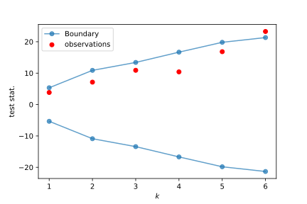

# Adaptive_stopping_MC_RL

Adaptive stopping when evaluating RL agents with evaluation estimated through Monte-Carlo methods.

## Quick start

The main algorithm is in `code/compare_agents.py` and is called `AgentComparator`.

In `code/example_deeprl/example_compare_agent.py` the comparator is used to know whether manager1 and manager2 are deemed different on the environment.

Example of plot describing the process of monitoring an evaluation statistic during the Monte-carlo evaluation, and comparing it to a boundary is the following.

## TODO:
- [ ] Have theoretical guarentees for the multiple testin
- [ ] Have speed of convergence for randomization distribution
- [ ] Have some theory on the MC sampling
- [ ] Do comparison with other methods in the litterature
- [ ] Do the simulation studies
- [ ] Do the empirical studies.
- [ ] Possible improvement: adapt Tukey's significant difference for a more performant (and non-pairwise) Multiple testing scheme. Much harder to have theoretical results on this.
## Refs:
- Permutation test https://www.jstor.org/stable/2533442?seq=1
- Stats in RL 1: https://arxiv.org/pdf/1806.08295.pdf
- Stats in RL 2: https://arxiv.org/pdf/1904.06979.pdf
- Nips paper: https://arxiv.org/abs/2108.13264
